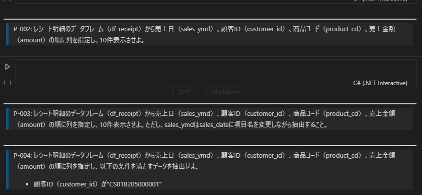
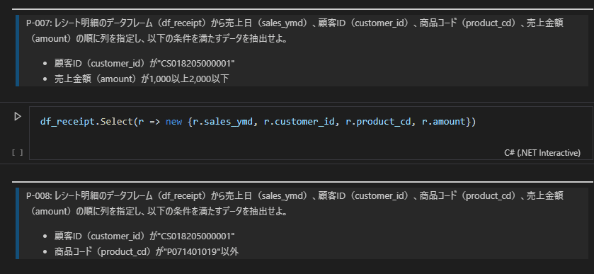

## 概要

データサイエンス 100 本ノック
https://github.com/The-Japan-DataScientist-Society/100knocks-preprocess

の演習問題では  `PostgreSQL` 、`Python` 、`R` での回答例が
ありましたが `C#` で の実装例を作ってみました。

## Overview (オリジナルからのコピー、一部改変)
- データサイエンス100本ノック（構造化データ加工編）を実践するための演習問題とデータ、および環境構築のためのスクリプト一式
- 演習問題はSQL、Python、R、C# で共通、
- 言語によっては向かない設問もあるが、「この言語のときはこう書けば実現できる」という技術習得を目指すことを優先
- 個人情報のように見える項目は全てダミーデータを利用
- 大学、企業など組織でのご利用にあたっては、「データサイエンティスト協会スキル定義委員」の「データサイエンス100本ノック（構造化データ加工編）」を利用していることを明示いただければ自由に利用してOK
- データサイエンス100本ノック(構造化データ加工編)の利用に関するご質問等について、個別での対応は受けかねますので予めご了承ください
- また、データサイエンス100本ノック(構造化データ加工編)の利用により生じるいかなる問題についても、当協会（訳注:データサイエンス協会）は一切の責任を負いかねますのであらかじめご了承ください。

## 環境構築手順

[Docker Desktop](https://docs.docker.com/docker-for-windows/install/) と [git](https://git-scm.com/download/win) を インストールします。

作業方用のディレクトリで
```
git clone [リポジトリURL]
cd [上記で作成したディレクトリ]
docker-compose up -d --build
```

オリジナルの データサイエンス 100本ノックの 環境と違い
PostgreSQL の環境は構築していません。

※ オリジナルでは サービスの起動順番の問題があり、まれにサーバが動作しない現象が発生するため、 今回は CSV ファイルを使ったデータ解析をする事にしました。

Jupyter サーバーが起動したのを確認して

`http://localhost:8889`

のページを開いてください。

work ディレクトリの中に データと Jupyter Notebook のファイルが入っています。

work ディレクトリは git で clone した フォルダの中の work ディレクトリを 参照しています。

Docker 環境がなくても WEB ブラウザだけで 実行する事が可能です。

[Binder](https://mybinder.org/) の WEB サイトに登録しているので

[](https://mybinder.org/v2/gh/kkato233/100knocks-data-scientist-cs/HEAD)

をクリックして ブラウザを開くと

notebook ディレクトリの中に データファイルと Jupyter Notebook のファイルが入っています。


## 効率的な開発環境構築

Web ブラウザ上で Jupyter Notebook の スクリプト編集は面倒です。

[Visual Studio Code](https://code.visualstudio.com/) をインストールし、

[.NET Interactive Notebooks](https://marketplace.visualstudio.com/items?itemName=ms-dotnettools.dotnet-interactive-vscode)
パッケージを追加し

[.NET 5 SDK](https://dotnet.microsoft.com/download/dotnet/5.0)
を インストールすると

Visual Studio Code で サクサク開発ができます。






